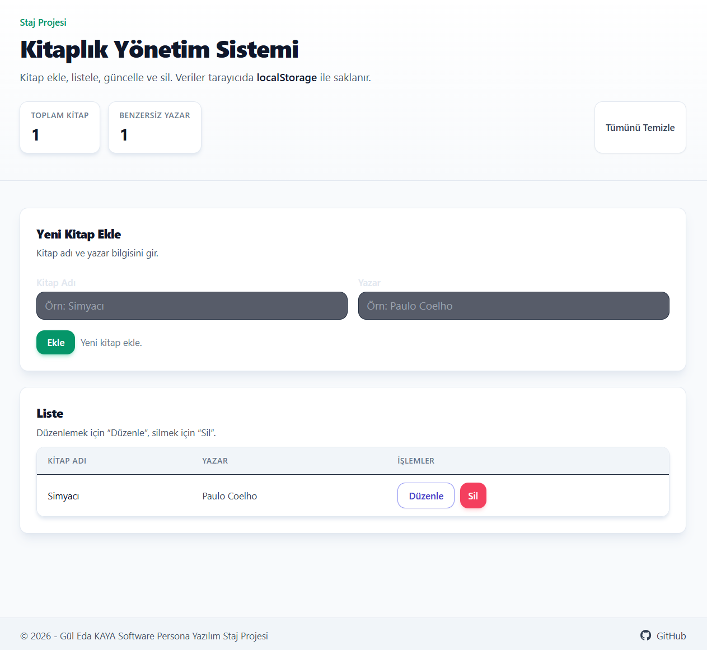

## Kitaplık Yönetim Sistemi

- **Canlı Demo**: `https://kitaplik-yonetim-sistemi-guledakaya.netlify.app/`
- **GitHub Repo**: `https://github.com/guledakaya/kitaplik-yonetim-sistemi`

Software Persona Yazılım Stajı kapsamında **React** ve **Tailwind CSS** kullanılarak geliştirilmiş, modern arayüze sahip bir **Kitaplık Yönetim Sistemi (CRUD uygulaması)**.

Uygulama ile kullanıcılar kitap ekleyebilir, mevcut kayıtları listeleyebilir, düzenleyebilir, silebilir ve tüm veriler **tarayıcı localStorage** alanında saklanır.

---

### Kurulum ve Çalıştırma

Projeyi klonladıktan sonra kök dizinde aşağıdaki adımları uygulayın:

```bash
npm install
npm run dev
```

Production build almak için:

```bash
npm run build
```

---

### Özellikler

- **Kitap Ekleme**: Kitap adı ve yazar bilgisini girerek yeni kayıt oluşturma.
- **Kitap Listeleme**: Tüm kitapları tablo görünümünde listeleme.
- **Kitap Düzenleme (Update)**: Listeden seçilen kitabın bilgilerini güncelleme.
- **Kitap Silme (Delete)**: İstenilen kitabı listeden kaldırma.
- **Kalıcı Veri Saklama**: Tüm kayıtlar tarayıcıdaki `localStorage` alanında tutulur; sayfa yenilendiğinde veriler kaybolmaz.

---

### Kullanılan Teknolojiler

- **Vite**: Hızlı geliştirme ortamı ve build aracı.
- **React**: Bileşen tabanlı modern frontend kütüphanesi.
- **Tailwind CSS**: Yardımcı sınıf (utility-first) yaklaşımıyla stillendirme.

---

### Klasör Yapısı ve Mimari

Proje yapısı, staj PDF yönergesine uygun olacak şekilde organize edilmiştir:

- **`src/Components`**  
  Tekrar kullanılabilir arayüz bileşenleri burada tutulur. Örneğin; butonlar, form alanları ve liste bileşenleri (`PrimaryButton`, `SecondaryButton`, `BookForm`, `BookList` vb.).

- **`src/Pages`**  
  Sayfa düzeyindeki bileşenleri içerir. Uygulamanın ana ekranı olan **`LibraryPage`**, tüm CRUD akışını (form + liste) bu klasör altında yönetir.

- **`src/Interfaces`**  
  Projede kullanılan veri modelleri ve tip tanımlarının tutulduğu klasördür. Bu projede **kitap** verisinin (id, title, author, tarihler vb.) yapısını tanımlamak için kullanılır.

Bu yapı sayesinde proje, bileşen-tabanlı ve sayfa-tabanlı olarak ayrışır; bakımı ve geliştirmesi daha kolay, PDF staj yönergelerine uygun bir mimari elde edilir.

